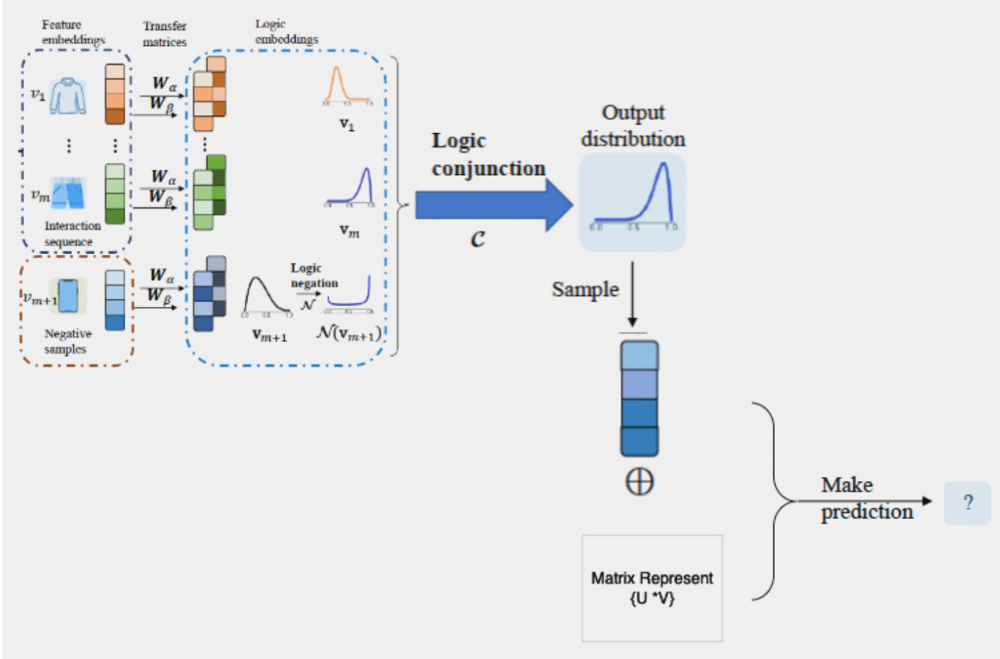

# Neural-Symbolic Integration for Recommendation Systems

This repository hosts the SR-PLR framework implementation, integrating matrix factorization with symbolic logic for enhanced recommendation systems using the adapted MovieLens dataset. It includes scripts for dataset modification, model training, and logic-enhanced matrix factorization evaluations.


## Project Abstract

This project explores the integration of matrix factorization and symbolic logic through the implementation of the SR-PLR framework. This approach aims to enhance interpretability and accuracy in recommendation systems by disentangling feature and logic embeddings, thus leveraging both neural network efficacy and symbolic reasoning.

## Model Diagram



Here you can see the architecture of the SR-PLR model which illustrates the integration points of neural networks and symbolic logic components.

## Key Terms

- **Neural-Symbolic Integration**: Combines deep neural networks with symbolic logic for enhanced interpretability and flexibility.
- **Probabilistic Logical Reasoning**: Uses probabilistic methods and logical operators to model uncertainties in user preferences and item characteristics.
- **Matrix Factorization (MF)**: Decomposes the interaction matrix into latent features representing user and item factors.
- **Alpha and Beta Parameters**: Shape parameters in Beta distributions modeling the dynamics of user preferences and item characteristics.

## Getting Started

### Prerequisites

- Python 3.8+
- NumPy
- TensorFlow or PyTorch

### Installation

Clone the repository:
```bash
git clone https://github.com/balassubramanian/Neural-Symbolic-Integration-for-Recommendation-Systems.git
```
### How to Use

To run the model, navigate to the project directory and execute:
```bash
python MF.py
```


Evaluation
The results demonstrate that the inclusion of symbolic logic enhances interpretability without compromising the accuracy of the model:

| Model         | Hyperparameters                      | NDCG@10 |
|---------------|--------------------------------------|---------|
| SLPLR RECSYS  | -                                    | 0.1261  |
| Mf            | lr=0.0001, re=0.001, epoch=100, hidden dime=64 | 0.9487  |
| Mf with logic | lr=0.001, re=0.0001, epoch=100, hidden dime=64 | 0.8021  |
| Mf with logic | lr=0.01, re=0.0001, epoch=100, hidden dime=64 | 0.9714  |
| Mf with logic | lr=0.0001, re=0.001, epoch=100, hidden dime=128 | 0.9628  |
| Mf with logic | lr=0.001, re=0.000001, epoch=100, hidden dime=128 | 0.1602  |


Contributors
Balassubramanian Srinivasan
Ziwei Zhu

Acknowledgments
Special thanks to all contributors and researchers who have provided insights and feedback on this project.


